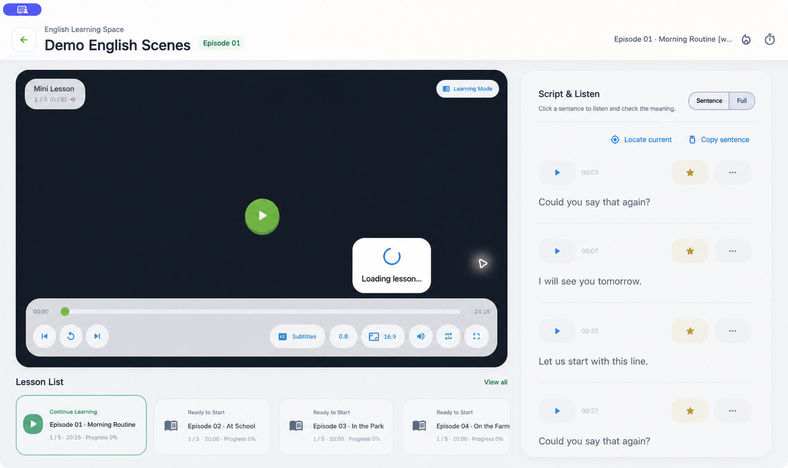
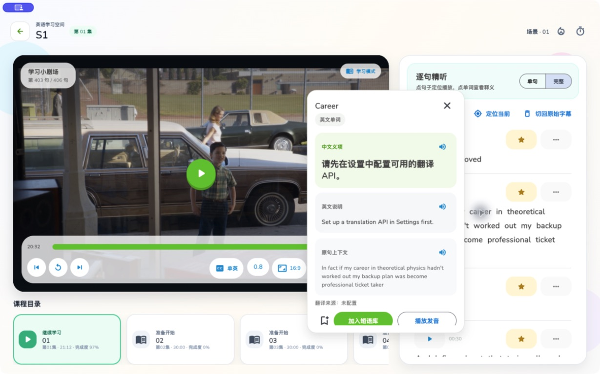
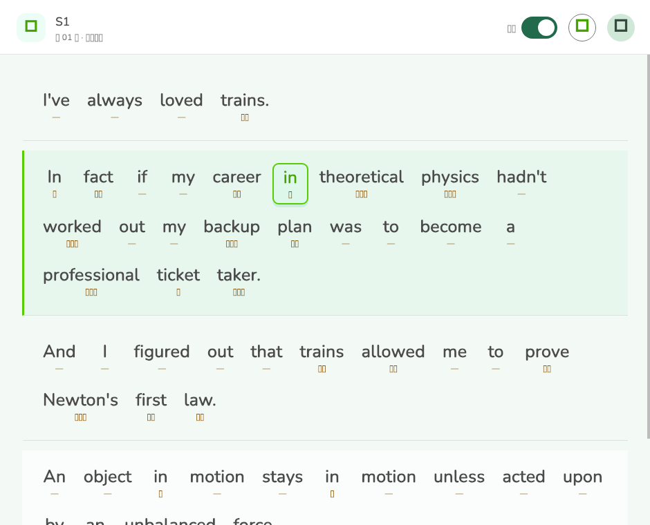
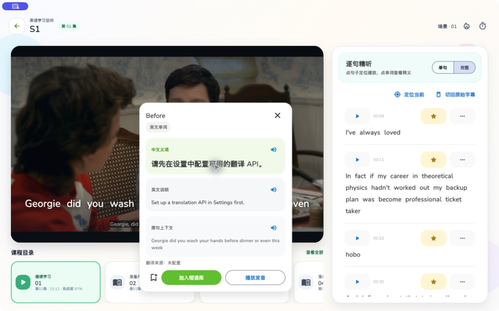
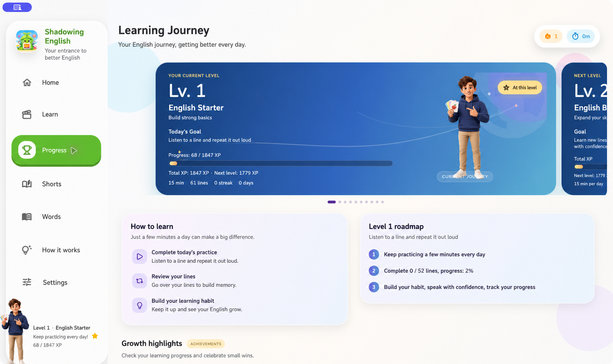
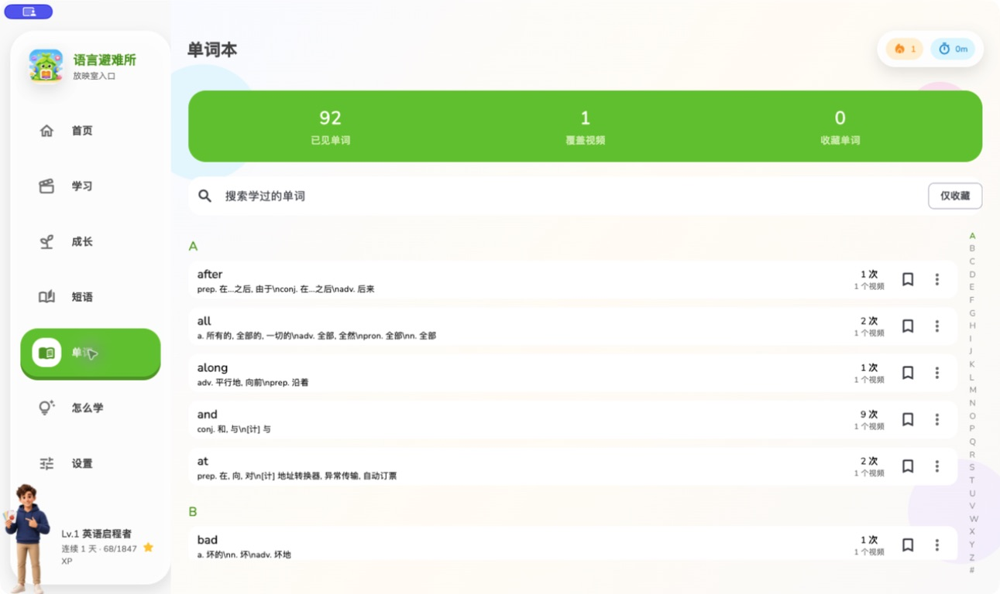
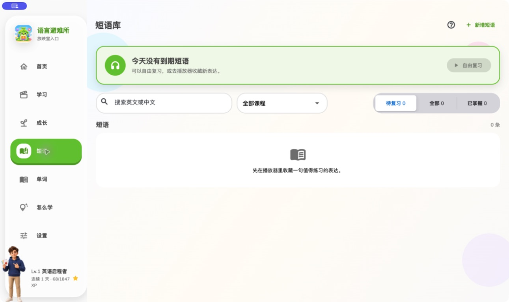
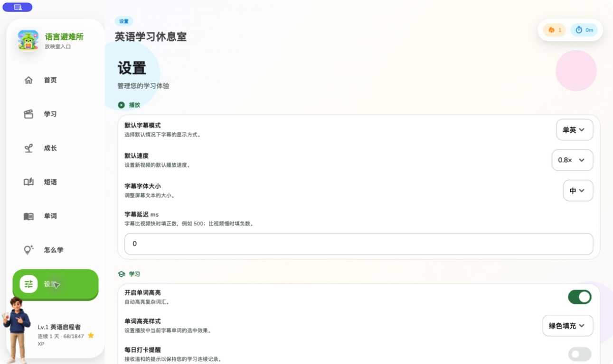

<p align="center">
  
</p>

<h1 align="center">Shadowing English</h1>

> A local-first English shadowing app for listening and speaking practice with your own videos and subtitles.

> 使用自己的视频和字幕，通过逐句精听、重复播放和影子跟读练习英语听力与口语。

[English](README_EN.md) · 中文

[](LICENSE)
[](https://github.com/MarkYuanGo/shadowing-english/actions/workflows/lint.yaml)
[](.fvmrc)
[](https://github.com/MarkYuanGo/shadowing-english/releases/latest)
[](https://github.com/MarkYuanGo/shadowing-english/releases/latest)
[](https://github.com/MarkYuanGo/shadowing-english/stargazers)
[](https://github.com/MarkYuanGo/shadowing-english/issues)

[下载最新版](https://github.com/MarkYuanGo/shadowing-english/releases/latest) · [字幕功能说明](#字幕功能从导入到逐词跟读) · [从源码运行](#从源码运行) · [导入学习素材](#导入学习素材)

## 功能截图

| 播放与逐句精听 | 导入本地视频与字幕 |
| :---: | :---: |
|  |  |
| 点按字幕、循环难句，在视频与原句之间保持专注。 | 选择自己的媒体与字幕，确认匹配后开始学习。 |
| 点词查译与上下文 | 全文逐词阅读与播放联动 |
|  |  |
| 点按字幕单词，立即查看释义、原句上下文，并可收藏或播放发音。 | 打开全文逐词阅读器，播放进度会同步定位当前句和单词。 |
| 视频字幕点词弹窗 | |
|  | |
| 视频正在播放时，也能直接点按画面字幕里的单词查看释义。 | |
| 三遍学习法 | 学习成长与等级 |
|  |  |
| 先理解，再精听，最后跟读。 | 记录练习、积累经验，清楚看到下一步。 |
| 单词本 | 短语复习 |
|  |  |
| 将查过的重点单词留在语境中继续复习。 | 收藏值得反复开口练习的表达。 |
| 字幕、翻译与播放设置 | |
|  | |
| 按自己的学习方式配置字幕与辅助能力。 | |

Shadowing English 是一个 English shadowing app：你导入自己有权使用的本地视频和字幕，用真实场景完成听懂、重复、模仿和开口表达。项目不提供任何影视、课程或字幕资源；学习素材保留在你的设备上。

## 什么是 Shadowing English

影子跟读不是只跟着念一遍台词。它把英语听力练习和英语口语练习放在同一段真实视频里：先理解内容，再辨认声音，最后模仿说话者的节奏、连读、语调和发音。

你可以把自己想看的内容变成字幕英语学习材料。单词和短语不会脱离语境，下一次也能回到原来的句子继续练。

## 影子跟读怎么学

1. **理解 Understand**：打开双语字幕，先了解剧情、人物关系和说话语气。
2. **精听 Listen**：切换到英文字幕，逐句定位、重复播放，把难句听清楚。
3. **跟读 Shadow**：减少字幕辅助，模仿原声的节奏、连读、重音与语调。

短句循环让听觉识别和口语输出不断衔接。每次只练几句，也能逐步从“看懂字幕”走到“听懂并说出来”。

## 核心功能

- **本地视频导入**：从设备选择自己的视频文件夹，建立个人课程库。
- **字幕导入与匹配**：导入 `.srt` 或 `.vtt` 字幕，按文件名和集数标记匹配视频与字幕。
- **逐句字幕导航**：点按字幕定位播放位置，在完整视频中专注当前句子。
- **单句重复播放**：快速重播当前句子，并可开启单句循环。
- **字幕显示模式**：根据学习阶段切换英文、双语或隐藏字幕。
- **字幕查词**：点按字幕中的单词查看释义，并保留在原始语境里。
- **逐词全文阅读**：打开全文后，当前播放句和单词会自动高亮定位。
- **视频字幕点词**：播放画面中的字幕单词同样可以直接点按查词。
- **单词与短语收藏**：将值得复习的单词和表达保存到单词本、短语库。
- **Shadowing 跟读模式**：记录每次跟读练习，让开口练习进入学习进度。
- **学习成长**：查看学习时长、句子、短语、课程进度、等级与成就。
- **可选 AI 字幕**：为没有现成字幕的视频生成或切换字幕，需要自行配置服务商。
- **本地优先**：视频、字幕和学习记录以设备本地内容为中心。

## 字幕功能：从导入到逐词跟读

Shadowing English 不只是在视频上显示一句字幕，而是把字幕变成可以定位、循环、查词和跟读的学习时间轴。你可以按素材情况选择以下方式：

- **导入外部字幕**：支持 `.srt` 和 `.vtt`。已有质量较好的字幕时，这是最直接的方式；英文和中文字幕可以按文件名自动匹配。
- **切换视频内置字幕**：如果视频文件本身带有可切换字幕轨道，可以在播放器的字幕菜单中选择，不需要先把字幕从视频中导出。
- **AI生成可跟读的词级同步字幕**：没有现成字幕，或现有字幕只有整句时间轴时，可以让 AI 识别音频，为每个英文单词生成开始和结束时间。

### 如何使用 AI 字幕

1. 打开“设置”，在“AI生成可跟读的词级同步字幕”中选择 ASR 服务商并填写自己的 API Key。默认配置为阿里云百炼，也支持设置页中列出的其他服务商。
2. 如果需要中英双语，保持“生成双语字幕”开启，并配置翻译服务；只需要英文字幕时可以关闭它。
3. 导入并播放视频，在播放器中点击“AI生成可跟读的词级同步字幕”。生成过程中可以看到当前识别进度。
4. 生成成功后，字幕会保存在本机并用于播放。进入“设置 → 管理 AI 字幕”，可以查看、按单词修改文本、导出、重新生成或删除字幕。

生成字幕会调用你选择的第三方服务，可能产生少量费用。API Key 请只填写在应用设置中，不要提交到仓库、截图或公开日志里。

### 它是怎么工作的

```text
本地视频
  → 在设备上提取并分段音频
  → ASR 服务识别英文和词级时间戳
  → 本地合并、检查并修复时间轴
  → 可选生成中文翻译
  → 保存到本机并随播放逐词高亮
```

如果素材已有英文外部字幕或可读取的内置字幕，应用会把它作为参考：保留更完整、可靠的原字幕文本，再利用语音识别结果补充或校准单词时间。参考字幕不会被静默覆盖；当识别结果或时间轴需要修复时，应用会给出提示。没有参考字幕时，则直接根据视频音频生成英文文本和时间轴。

### 相比普通字幕的优势

- **逐词同步，而不只是整句同步**：正在说的单词会随播放高亮，更容易辨认连读、弱读和重音。
- **字幕直接参与学习**：点一句即可跳转，难句可以循环；点单词可查译，也可以在全文阅读中跟随播放定位。
- **充分利用已有字幕**：质量较好的原字幕负责正文，AI 更专注于补全词级时间，减少纯语音识别造成的漏词和错词。
- **生成结果可管理**：字幕保存在本机，可以编辑、导出、重新生成和删除，不必每次播放都重新调用服务。
- **失败时尽量保留可用结果**：应用会在本地修复常见的时间重叠、缺失时间戳等问题，并在中文翻译未完成时优先保留已经生成的英文字幕。

AI 识别仍可能受到背景音乐、多人重叠说话、口音和录音质量影响。重要内容建议使用已有字幕作为参考，并在“管理 AI 字幕”中检查后再长期使用。

## 为什么使用它

- **从你真正想看的视频开始**：看视频学英语不必依赖固定课程包。
- **让表达留在场景中**：单词、句子和短语来自真实对话，而不是孤立列表。
- **同一句可以反复练**：逐句定位与循环播放适合精听和 English shadowing practice。
- **听力和口语一起练**：先听懂，再跟读，减少“认识但说不出”的断层。
- **素材由你掌控**：本地视频和字幕不会被项目服务器收集或分发。

## 开始使用

### 下载应用

最新版为 [v0.1.1](https://github.com/MarkYuanGo/shadowing-english/releases/tag/v0.1.1)，已提供以下安装包：

- Android：APK
- macOS：DMG
- Linux：x64 `.tar.gz`
- Windows：x64 `.zip`

前往 [Releases](https://github.com/MarkYuanGo/shadowing-english/releases/latest) 选择对应平台下载。

从 v0.1.2 起，每个版本附带 `SHA256SUMS.txt`，可用于校验下载文件是否完整。

桌面安装包内置了用于本地音频提取的精简版 FFmpeg，无需用户额外安装；许可证和构建信息会随应用一起发布。

桌面安装包还内置了 [whisper.cpp](https://github.com/ggml-org/whisper.cpp) 与多语言 `small` 模型（`ggml-small.bin`），可在「设置 → AI 字幕」中选择「本地 Whisper」离线智能识别多国语言并生成词级同步字幕，无需联网、无需 API Key。安装包体积因此增大约 466 MB。

### 从源码运行

需要 Flutter 3.44.4；仓库通过 FVM 固定版本。首次使用请先安装 [FVM](https://fvm.app/documentation/getting-started/installation)。

```bash
git clone https://github.com/MarkYuanGo/shadowing-english.git
cd shadowing-english
fvm use 3.44.4
fvm flutter pub get
fvm flutter run
```

在 VS Code 中安装 Flutter 与 Dart 扩展，打开项目根目录后，选择运行和调试配置 `Flutter - Prod (select device)`，再按 F5。项目会通过 `.fvm/flutter_sdk` 使用固定的 Flutter 版本；请不要提交本机 SDK 路径、设备 ID 或密钥。

如果使用自己的 Flutter 环境，也可以执行：

```bash
flutter pub get
flutter run
```

## 导入学习素材

推荐让视频与字幕使用相同的集数命名，例如：

```text
Friends-S01E01.mp4
Friends-S01E01.en.srt
Friends-S01E01.zh.srt
```

英文字幕可以是同名的 `Friends-S01E01.srt`，也可以通过 `.en`、`_en`、`english` 等文件名标记识别。导入前请确认你拥有相应媒体和字幕的使用权。

更多说明见 [RESOURCE_SETUP.md](RESOURCE_SETUP.md)。仓库不附带影视内容、商业字幕或未经授权的学习资源。

## 隐私

- 视频、字幕和学习记录以本地设备为中心保存和管理。
- 项目不会提供或托管你的课程资源。
- 如果你启用 AI 字幕或翻译，会使用你自行配置的第三方服务；相应请求由该服务商处理。

## 参与贡献

欢迎提交 [Issue](https://github.com/MarkYuanGo/shadowing-english/issues)，尤其是字幕匹配、播放器与跨平台问题。准备 Pull Request 前，建议先开 Issue 讨论；请不要提交未经授权的视频、字幕或课程资源。

## License

Shadowing English 使用 [MIT License](LICENSE) 开源。

如果你正在寻找一个用本地视频练习英语听力、英语跟读和英语口语表达的工具，欢迎试试 Shadowing English。
